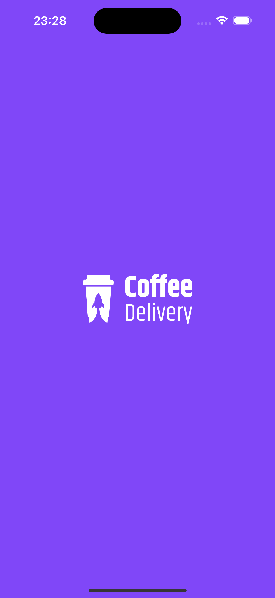
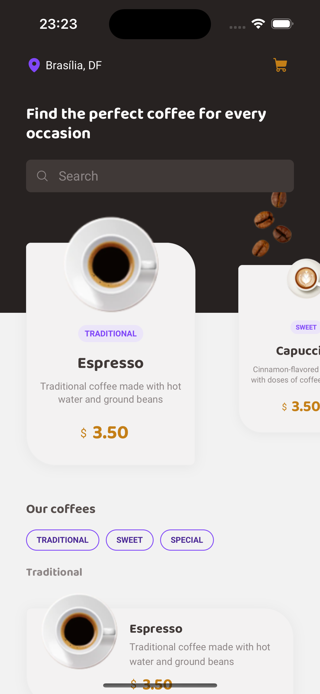
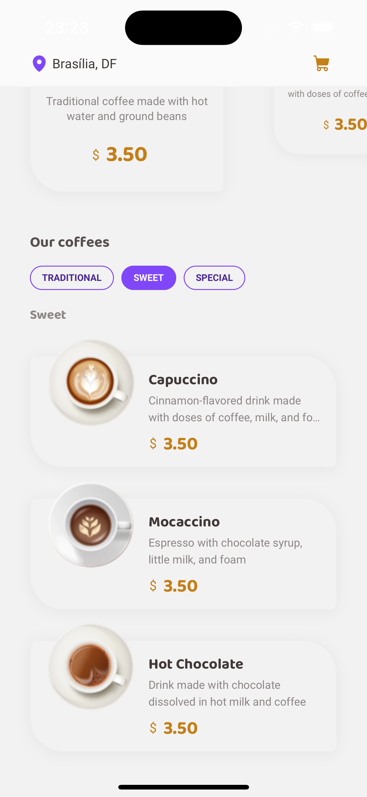
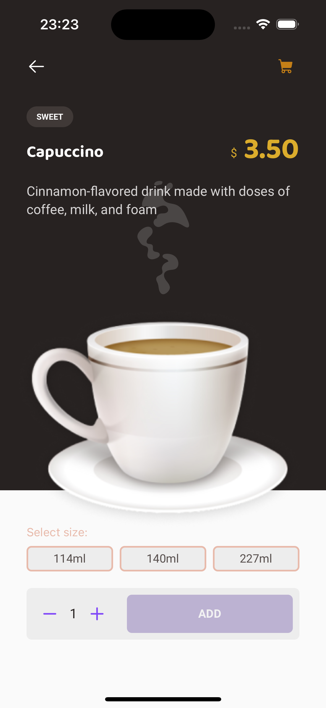
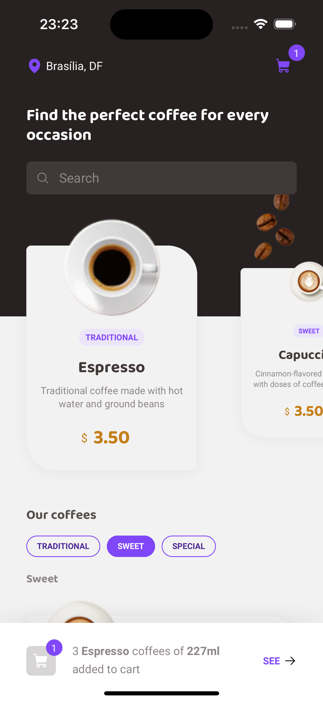
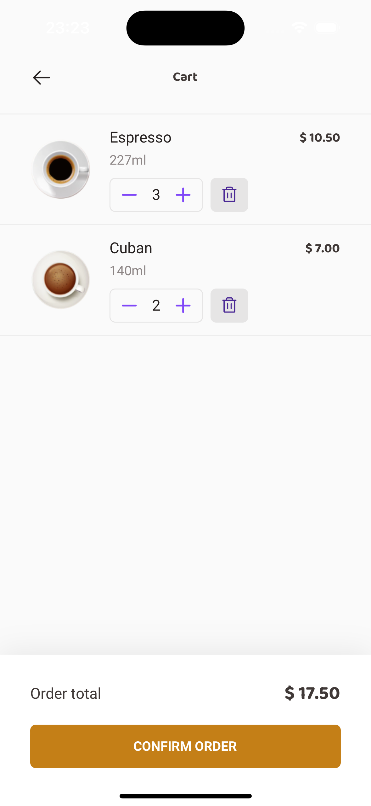
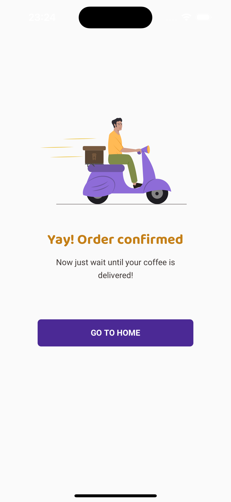

# Coffee Delivery App
## The App
This is a beverage delivery app for coffee lovers ☕️❤️. 
Select the type of coffee you desire, its quantity and add it to cart.  
Edit your final order and with one touch your coffees are on the way!

### Previews

  
  

  
  

  
  

  

### Techs
1. React Native
2. Typescript
3. Gluestack UI
4. Phosphor Icons
5. React Navigation
6. React Native Reanimated
7. MMKV (AsyncStorage Alternative)
8. Expo AV
9. Expo Haptics

### Functions
- Add coffes to your cart:
  Putting the new **MMKV** lib to use the device's local storage smoothly.
- Setting final order:
  Changing quantity, deleting unwanted coffees from your cart and navigating through catalog with ease using **React Native Reanimated**.
- Have sound and physical feedbacks with **Expo AV** and **Expo Haptics**.

### Steps
1. Clone this repository;
2. Run your preferred command to install dependencies:
- `npm install`
3. Run `npx expo prebuild` and `npx expo run:ios` or `npx expo run:android`.
4. Run the app with: 
- `npm run ios` or `npm run android`
